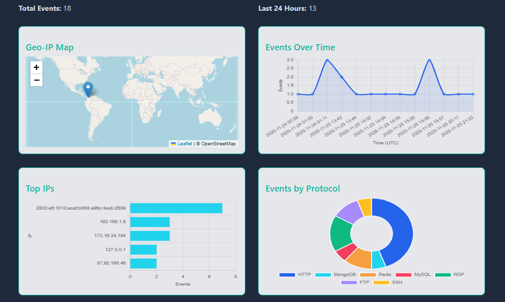

# Mini SIEM Dashboard

# 

Demo currently offline as the honeypot is not continuously deployed to control operational costs.
Source code, architecture, and sample dashboards are available in the repository.

A small honeypot + mini-SIEM written in Python (Flask) with a modern JavaScript dashboard.  
It logs connection events from fake TCP services and displays basic analytics in a responsive web UI.

This is designed for **home-lab / research / portfolio** use. It can safely be exposed to the internet as a lightweight honeypot, but it is **not** a full-featured enterprise SIEM.

---

## Features

- **Multi-service honeypot listeners**
  - Fake services for SSH, FTP, RDP, MySQL, Redis, MongoDB, and HTTP
  - Configurable ports (high ports by default for lab / container hosting)

- **Structured event logging**
  - Events appended to `data/events.json` (capped at ~10,000 events)
  - Enriched event schema, for example:
    - `timestamp` – ISO 8601 UTC
    - `ip` – normalized source IP (IPv4 or IPv6)
    - `port` – destination port
    - `src_port` – source port
    - `protocol` – `HTTP`, `SSH`, `FTP`, `RDP`, `MySQL`, `Redis`, `MongoDB`
    - `event_type` – `request`, `connection`, etc.
    - `method`, `path` – HTTP method/path when applicable
    - `user_agent` – HTTP User-Agent when present
    - `banner_sent` – whether a honeypot banner was sent

- **Backend-only Geo-IP lookups**
  - Flask backend enriches public IPs using `ipwho.is`
  - Private/internal addresses (127.0.0.1, 192.168.x.x, 10.x.x.x, 172.16/12) are **not** geolocated
  - Results cached on disk (`data/geo_cache.json`) to avoid repeated API calls

- **Dashboard UI**
  - Single-page dashboard with:
    - **Geo-IP map** (Leaflet + OpenStreetMap)
    - **Events over time** (Chart.js)
    - **Top IPs** (Chart.js)
    - **Events by protocol** (Chart.js)
    - **Top IPs (table)**
    - **Top ports (table)**
    - **Recent events** 

---

## Requirements

- Python 3.8+
- Recommended Python packages (via `requirements.txt`), for example:
  - `Flask`
  - `requests`
- Internet access for:
  - Backend Geo-IP lookups (ipwho.is)
  - Map tiles (OpenStreetMap via Leaflet) in the browser

Tested on Windows; should also work on Linux / macOS with minor or no changes.

---

## Local Setup

1. **Clone the repository**

       git clone https://github.com/jeremyrayjewell/mini-siem-dashboard.git
       cd mini-siem-dashboard

2. **Create and activate a virtual environment (optional, but recommended)**

   **Windows (PowerShell):**

       python -m venv venv
       .\venv\Scripts\Activate.ps1

   **Linux / macOS:**

       python3 -m venv venv
       source venv/bin/activate

3. **Install dependencies**

   If a `requirements.txt` is present:

       pip install -r requirements.txt

   Or minimally:

       pip install flask requests

4. **Run the app locally**

   From the repo root:

       python -m backend.app

   By default, the dashboard will be available at:

   - http://localhost:5000

---

## Quick Test

With the app running locally:

- In your browser, visit:

  - `http://localhost:5000/wp-login.php`

- Or generate a quick HTTP event with `curl`:

      curl http://localhost:5000/wp-login.php

Then open the dashboard (http://localhost:5000) and you should see:

- New entries in the **Recent Events** table  
- Updated **Top IPs**, **Top Ports**, and charts

For TCP honeypot services, you can also hit the configured ports with tools like `nmap`, `telnet`, or `nc` from another host.

---

## Usage

- The dashboard periodically polls `/api/stats` and refreshes:
  - Total events / last 24 hours
  - Top IPs and ports
  - Charts and the Recent Events table

- Events are generated from:
  - **Honeypot TCP traps**: SSH, FTP, RDP, MySQL, Redis, MongoDB on configurable ports
  - **HTTP requests**: most paths other than the dashboard itself (e.g., `/wp-login.php`, `/admin`, etc.)

- The **Geo-IP map**:
  - Only shows markers for **public** IP addresses
  - Private/internal IPs (127.0.0.1, 192.168.x.x, 10.x.x.x, 172.16/12) are **skipped** for geolocation
  - Uses backend Geo-IP lookup + caching; the browser does not talk to any external Geo-IP API directly

- To reset all events (dangerous; clears history):

      curl -X POST http://localhost:5000/admin/reset-events

---

## Internet-Facing / Lab Deployment Notes

This project works well as a small internet-facing honeypot for a home lab or research:

- Run it in an **isolated environment**:
  - Dedicated VM or container
  - No direct access to production systems or sensitive data

- Treat **all** incoming traffic as potentially hostile:
  - The services are fake, but the network stack is real
  - Don’t reuse secrets, credentials, or keys from other environments

- Typical deployment pattern:
  - **Backend** on a small VPS or PaaS (e.g. Fly.io) exposing TCP and HTTP ports
  - **Static dashboard** served by the same Flask app or a static host (e.g. Netlify)

---

## Architecture

- **Honeypot traps (`backend/traps.py`)**
  - Python socket listeners for:
    - SSH, FTP, RDP, MySQL, Redis, MongoDB (on high ports by default)
  - Each connection is normalized into a JSON event and appended to `data/events.json`
  - Basic banners can be served for some protocols (`banner_sent` flag)

- **Flask backend (`backend/app.py`)**
  - Serves the static dashboard (HTML/CSS/JS)
  - Exposes a single REST endpoint, `/api/stats`, which returns:
    - Aggregated metrics:
      - `totalEvents`
      - `last24h`
      - `topIPs` (with counts)
      - `topPorts`
    - `recentEvents` (most recent events with enriched fields)
    - `geoIPs` (public IPs with country + lat/lon for the map)
  - Performs server-side Geo-IP lookups via ipwho.is and caches results

- **Frontend dashboard**
  - Plain HTML/CSS/JS (no heavy framework)
  - Uses:
    - **Chart.js** for:
      - Events over time (line chart)
      - Top IPs (bar chart)
      - Events by protocol (bar / donut)
    - **Leaflet + OpenStreetMap** for:
      - Geo-IP map of source IPs
  - Renders:
    - Top IPs / ports tables
    - Recent Events table with synthesized message strings:
      - HTTP: `HTTP <METHOD> <PATH> from <IP>`
      - TCP traps: `Connection from <IP>:<SRC_PORT> via <PROTOCOL>`

---

## Troubleshooting

- **Map is empty / “no geo data yet”**
  - Confirm you have events from **public IPs**
  - Local/private IPs are intentionally not geolocated
  - Ensure the server can reach `https://ipwho.is/` and that the browser can load map tiles

- **Ports won’t bind / address in use**
  - Check that the desired ports aren’t already in use
  - On Linux/macOS, you may need elevated privileges to bind to low ports
  - You can change ports in `backend/traps.py`

- **No events appearing**
  - Confirm `backend.app` is running and `data/events.json` is being updated
  - Generate test traffic (see **Quick Test**)
  - Check the console logs for Python exceptions

---

## License

---

## Author

Jeremy Ray Jewell  
[GitHub](https://github.com/jeremyrayjewell) · [LinkedIn](https://www.linkedin.com/in/jeremyrayjewell)
